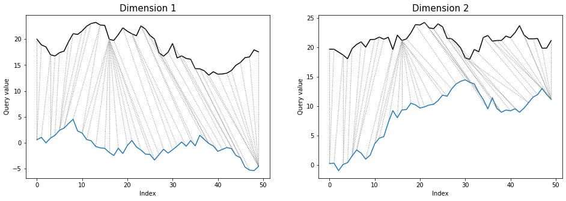
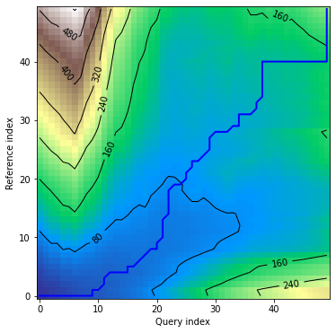
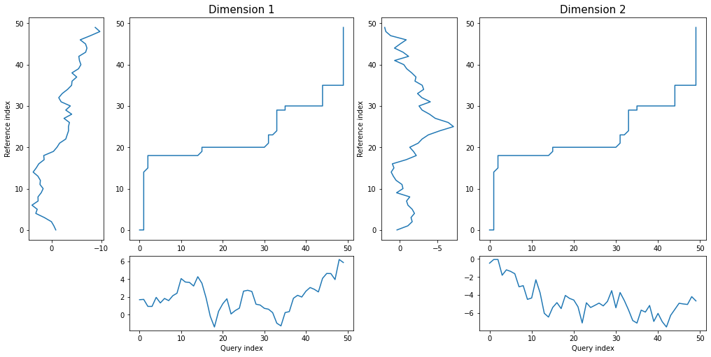

# Shape DTW python package
**shapedtw-python** is an extension to the **[dtw-python](https://github.com/DynamicTimeWarping/dtw-python)** package, implementing
the shape dtw algorithm described by L. Itii and J. Zhao in their paper (it can be downloaded from here: [shapeDTW: shape Dynamic Time Warping](https://arxiv.org/pdf/1606.01601.pdf)).

In addition, to enable users to fully exploit the potential of the dtw and shape-dtw algorithms in practical applications, we have enabled the use of both versions of the multidimensional 
variant of the algorithm (dependent and independent), according to the methodology described in the paper by B. Hu, H. Jin, W. Keogh, M. Shokoohi-Yekta and J. Wang:
[Generalizing DTW to the multi-dimensional case requires an adaptive approach](https://www.ncbi.nlm.nih.gov/pmc/articles/PMC5668684/). 

Github repository of the *shapedtw-python* project
can be found here: [shapedtw-python](https://github.com/MikolajSzafraniecUPDS/shapedtw-python).

# Introduction to the shape dtw algorithm
In order to fully understand the shape dtw algorithm it is good to know the methods for calculating standard dtw.
We recommend to get familiarized with classic work of S. Chiba and H. Sakoe (available online here:
[Dynamic Programming Algorithm Optimization for Spoken Word Recognition](https://www.yumpu.com/en/document/view/29791622/dynamic-programming-algorithm-optimization-for-spoken-word-), 
however one can prefer to read this shorter, yet comprehensive guide: [An introduction to Dynamic Time Warping](https://rtavenar.github.io/blog/dtw.html)

### Shape descriptors
In case of standard DTW we use raw time series values to determine the alignment (warping) path by which two
signals (time series) can be aligned in time. Such alignment may be susceptible to local distortion and therefore
does not fully reflect the correct relationships between signals. Zhao and Itti proposed to solve this problem by 
using so-called shape descriptors, instead of single points of time series:

> Yet, matching points based solely on their coordinate
values is unreliable and prone to error, therefore, DTW may
generate perceptually nonsensible alignments, which wrongly pair
points with distinct local structures (...). This partially
explains why the nearest neighbor classifier under the DTW
distance measure is less interpretable than the shapelet classifier
[35]: although DTW does achieve a global minimal score, the
alignment process itself takes no local structural information into
account, possibly resulting in an alignment with little semantic
meaning. In this paper, we propose a novel alignment algorithm,
named shape Dynamic Time Warping (shapeDTW), which enhances DTW by incorporating point-wise local structures into the
matching process. As a result, we obtain perceptually interpretable
alignments: similarly-shaped structures are preferentially matched
based on their degree of similarity. (...)
> 
> Itti, L.; Zhao, J., shapeDTW: shape Dynamic Time Warping, 
> Pattern Recognition, Volume 74, pp. 171-184, Feb 2018.

According to Zhao and Itti shape descriptor *encodes local structural information
around the temporal point t<sub>i</sub>*. 

In order to calculate shape descriptor we need 
to - as a first step - retrieve the **subsequences** for all points of given time series.
Subsequences are simply a subsets of time series, representing neighbourhood of particular
temporal observation, which is a central point of given subsequence. 

As a next step we need to calculate 
shape descriptors for all the subsequences. Shape descriptor is simply a function applied to given
subsequence, which allows to properly describe its local shape's properties (like slope, mean
values, wavelet coefficients, etc.). The most simple shape descriptor might be a raw subsequence
itself. 

Then, we calculate the distance matrix - required by the dtw algorithm - based on obtained
shape descriptors instead of raw, single values of time series. Finally warping path is determined based
on such distance matrix.

#### Types of shape descriptors
- Raw subsequence - raw subsequence; there is no any transformation applied to it. 
- PAA - subsequence is split into *m* disjoint intervals. For each interval we calculate mean value of temporal points falling into it. Vector of such mean values is our shape descriptor.
- DWT - Discrete Wavelet Transform is applied to whole subsequence. Wavelet coefficients are bound into the form of vector, which we use as a shape descriptor.
- Slope - similarly as in case of PAA we split subsequence into *m* disjoint intervals and fit a line according to points falling within each interval. Slopes of lines are bound to the form of vector and use as a shape descriptor. This type of shape descriptor is invariant to y-shift.
- Derivative - first order derivatives of given subsequence, calculated using the formula presented in this paper: [Derivative Dynamic Time Warping](https://www.ics.uci.edu/~pazzani/Publications/sdm01.pdf).Similarly as slope descriptor it is invariant to y-shift.
- Compound descriptor - two or more shape descriptors bound into a form of single vector. We can use weights to compensate for differences in average descriptor values.

All shape descriptors listed above are described in details in Zhao and Itti [paper](https://arxiv.org/pdf/1606.01601.pdf).

# Code examples
### Quick example
Below is a brief example for anyone who wants to get started quickly with the 'shape dtw' algorithm.

Let's calculate shape dtw alignment and distance for two time series, one of which is slightly shifted 
and distorted with respect to the other.

As a first step we need to make necessary imports:

```python
import numpy as np
import pandas as pd
from numpy.random import randn
from shapedtw.shapedtw import shape_dtw
from shapedtw.shapeDescriptors import SlopeDescriptor, PAADescriptor, CompoundDescriptor
from shapedtw.dtwPlot import dtwPlot
```

Now let's define input time series and take a look at them:

```python
np.random.seed(9)
distortion_factor = 1
ts_x = np.cumsum(randn(100))
ts_y = np.concatenate(
    (
        np.cumsum(randn(15)),
        ts_x[:85]
    )
) + (randn(100)*distortion_factor)

df = pd.DataFrame({"ts_x": ts_x, "ts_y": ts_y})
df.plot()
```


As a final step we will define shape descriptor and run the algorithm to obtain alignment path.
We will use compound descriptor, consisting of slope descriptor (y-shift invariant) and PAA descriptor.

```python
slope_descriptor = SlopeDescriptor(slope_window=5)
paa_descriptor = PAADescriptor(piecewise_aggregation_window=5)
compound_descriptor = CompoundDescriptor([slope_descriptor, paa_descriptor],descriptors_weights=[5., 1.])
shape_dtw_results = shape_dtw(
    x=ts_x,
    y=ts_y,
    subsequence_width=20,
    shape_descriptor=compound_descriptor
)

dtwPlot(shape_dtw_results, plot_type="twoway", yoffset = 30)
```


As we can see, despite the shift and distortion of the reference series, the shape dtw algorithm has reproduced
the true alignment path almost completely correctly.

Finally, we can retrieve a distances from *shape_dtw_results* object in the following way:

```python
print(round(shape_dtw_results.distance, 2))
196.58

print(round(shape_dtw_results.normalized_distance, 2))
0.98

print(round(shape_dtw_results.shape_distance, 2))
1276.43

print(round(shape_dtw_results.shape_normalized_distance, 2))
6.38
```

*distance* and *normalized_distance* are distances between raw values of time series, whereas *shape_distance*
and *shape_normalized_distance* are distances between shape descriptors of time series. Details are
explained in the sections below.

### Calculation process in details
The whole process of calculating shape dtw consists out of a few steps:
- Transform time series to the matrix of subsequences. In multivariate case each dimension is transformed to individual subsequence's matrix.
- Transform subsequences to shape descriptors using chosen mapping function (shape descriptor).
- Calculate distance matrix between shape descriptors.
- Pass distance matrix to *dtw* function from *dtw-python* package in order to calculate warping path and distance.
- Calculate distance for raw time series values using warping path determined by shape dtw.

Although - as we saw in the previous section - *shapedtw-python* package implements whole pipeline described above in a single 
call to the **shape_dtw** function, we will go through all this steps in this document in order to get better 
understanding of the whole process.

As a first step we will define short, univariate time series and transform them to subsequences. In order to
do this we will need to import *UnivariateSubsequenceBuilder* class from *preprocessing* module.

```python
import numpy as np
from shapedtw.preprocessing import UnivariateSubsequenceBuilder

subsequence_width = 1

ts_x = np.array([1, 2, 3, 4])
ts_y = np.array([11, 12, 13, 14])


ts_x_subsequences = UnivariateSubsequenceBuilder(
    ts_x, subsequence_width
).transform_time_series_to_subsequences()
ts_y_subsequences = UnivariateSubsequenceBuilder(
    ts_y, subsequence_width
).transform_time_series_to_subsequences()

print(ts_x_subsequences.subsequences)
[[1 1 2]
 [1 2 3]
 [2 3 4]
 [3 4 4]]

print(ts_y_subsequences.subsequences)
[[11 11 12]
 [11 12 13]
 [12 13 14]
 [13 14 14]]
```

Parameter *subsequence_width* controls the width of subsequence. For *subsequence_width*=1 the entire
subsequence has a length of 3 (for each temporal point we take one predecessor and one successor). 
At the beginning and at the end of time series we need to replicate first and last
observation in order to make subsequences well-defined for all of temporal points. 

Actually, we can consider standard dtw as a special case of shape dtw with *subsequence_width*=0 
and *RawSubsequenceDescriptor* as a shape descriptor.

As a next step we will calculate shape descriptors for all subsequences using the PAA descriptor.

```python
from shapedtw.shapeDescriptors import PAADescriptor

paa_descriptor = PAADescriptor(piecewise_aggregation_window=2)
ts_x_shape_descriptors = ts_x_subsequences.get_shape_descriptors(paa_descriptor)
ts_y_shape_descriptors = ts_y_subsequences.get_shape_descriptors(paa_descriptor)

print(ts_x_shape_descriptors.shape_descriptors_array)
[[1.  2. ]
 [1.5 3. ]
 [2.5 4. ]
 [3.5 4. ]]

print(ts_y_shape_descriptors.shape_descriptors_array)
[[11.  12. ]
 [11.5 13. ]
 [12.5 14. ]
 [13.5 14. ]]
```

*Windowing* descriptors, such as *slope* or *PAA* split subsequences into disjoint intervals. In a situation such as above, 
when it is not possible to divide the sub-sequence into n intervals of equal length, the length of the last interval is 
equal to the remainder of the division *length of the subsequence / length of the window*. In this case, the first value 
of the PAA descriptor is the average value of the first two values of the subsequence, and the second value of the PAA 
descriptor is the third value of the subsequence.

Finally, the distance matrix between the shape descriptors is calculated and passed to the *dtw.dtw* function along with 
other parameters (originally these additional parameters are passed to the *shape_dtw* function).

```python
from dtw import dtw

distance_matrix = ts_x_shape_descriptors.calc_distance_matrix(ts_y_shape_descriptors)
dtw_results = dtw(distance_matrix.dist_matrix)

print(round(dtw_results.distance, 2))
89.5

print(round(dtw_results.normalizedDistance, 2))
11.19
```

Please bare in mind that distance calculated in such a way is a distance between **shape descriptors** of time
series, not time series itself. Of course it can be treated as a distance measure and used for example
to find nearest neighbour in classification tasks, however one can prefer to use distance between raw values
of time series. In order to reconstruct such distance, we can use *DistanceReconstructor* class.

In case of *shape_dtw* function raw distances are calculated by defult and
available as *distance* and *normalized_distance* attributes of classes representing shape dtw results.

To calculate raw distances we must provide raw time series, warping path determined by the shape dtw algorithm,
step pattern and distance method which were used. In the example above, we have used the step pattern *symmetric2*
and *euclidean* distance, as these are the default values for these parameters.

```python
from shapedtw.shapedtw import DistanceReconstructor

dist_reconstructor = DistanceReconstructor(
    step_pattern="symmetric2",
    ts_x=ts_x,
    ts_y=ts_y,
    ts_x_wp=dtw_results.index1s,
    ts_y_wp=dtw_results.index2s,
    dist_method="euclidean"
)

raw_ts_distance = dist_reconstructor.calc_raw_ts_distance()
print(round(raw_ts_distance, 2))
8.45
```

Normalized raw distance is calculated internally by class representing shape dtw results, 
using the step pattern settings.

# Multidimensional variants of shape dtw
For multidimensional time series we need to create subsequence matrix and shape descriptor matrix for each
dimension separately. There are two variants of multivariate shape dtw - *dependent* and *independent*. Differences
between those variants are described in details in the paper mentioned above: 
[Generalizing DTW to the multi-dimensional case requires an adaptive approach](https://www.ncbi.nlm.nih.gov/pmc/articles/PMC5668684/).

The most important information is that in case of multivariate *dependent* shape dtw there is one, common warping
path for the whole time series. As for *independent* variant, each dimension has his own warping path, calculated
independently for it. We can select desired variant specifying *multivariate_version* parameter of *shape_dtw*
function as '*dependent*' or '*independent*':

```python
import numpy as np
from numpy.random import randn
from shapedtw.shapedtw import shape_dtw
from shapedtw.dtwPlot import dtwPlot
from shapedtw.shapeDescriptors import SlopeDescriptor

np.random.seed(9)
ts_x = np.cumsum(randn(50, 2), axis=0)
ts_y = np.cumsum(randn(50, 2), axis=0)

slope_descriptor = SlopeDescriptor(slope_window=3)
subsequence_width = 3

shape_dtw_dependent_results = shape_dtw(
    x=ts_x,
    y=ts_y,
    subsequence_width=subsequence_width,
    shape_descriptor=slope_descriptor,
    multivariate_version="dependent"
    
)
shape_dtw_independent_results = shape_dtw(
    x=ts_x,
    y=ts_y,
    subsequence_width=subsequence_width,
    shape_descriptor=slope_descriptor,
    multivariate_version="independent"
    
)

dependent_distance = round(shape_dtw_dependent_results.distance, 2)
independent_distance = round(shape_dtw_independent_results.distance, 2)

print(dependent_distance)
740.77

print(independent_distance)
956.44
```

Differences between warping paths can be clearly seen at the *twoway* plots:

```python
dtwPlot(shape_dtw_dependent_results, plot_type="twoway", xoffset=20)
```


```python
dtwPlot(shape_dtw_independent_results, plot_type="twoway", xoffset=20)
```


# DTW parameters
For *shape dtw* we can use exactly the same additional parameters as for the *dtw* package. Below you can see
see an example of specifying a sakoechiba window with a window size of 10:

```python
import numpy as np
from numpy.random import randn
from shapedtw.shapedtw import shape_dtw
from shapedtw.dtwPlot import dtwPlot
from shapedtw.shapeDescriptors import SlopeDescriptor

np.random.seed(3)
ts_x = np.cumsum(randn(50))
ts_y = np.cumsum(randn(50))

slope_descriptor = SlopeDescriptor(slope_window=3)

shape_dtw_res = shape_dtw(
    x=ts_x,
    y=ts_y,
    subsequence_width=3,
    shape_descriptor=paa_descriptor,
    window_type="sakoechiba",
    window_args={"window_size": 10},
    keep_internals=True
)

dtwPlot(shape_dtw_res, plot_type="density")
```


# Plots
We reused ploting mechanism from the *dtw* package in its core, however it was extended in order to
allowing to plot multivariate shape dtw results as well. 

In case of multivariate, dependent shape dtw the structure of both *alignment* and *density* plots 
look the same as in univariate version. The reason is that there is a single warping path,
common for all dimensions. There are differences - comparing to univariate case - for *twoway* and *threeway* plots, 
as we want to show matching for all of time series dimensions. Therefore, instead of showing a single plot, we need to 
use a pyplot grid, containing as many plots as many dimensions time series has. 

As for multivariate independent shape dtw, all types of plots require to use a pyplot grid. The reasin is that
every single dimension has dedicated warping path, which we would like to show.

### Plots - univariate case
As for univariate case, shape dtw plots are exactly the same as in case of *dtw* package. Let's calculate shape dtw
for randomly generated time series:

```python
import numpy as np
from numpy.random import randn
from shapedtw.shapedtw import shape_dtw
from shapedtw.dtwPlot import dtwPlot
from shapedtw.shapeDescriptors import SlopeDescriptor

np.random.seed(6)
ts_x = np.cumsum(randn(50))
ts_y = np.cumsum(randn(50))

slope_descriptor = SlopeDescriptor(slope_window=3)

shape_dtw_res = shape_dtw(
    x=ts_x,
    y=ts_y,
    subsequence_width=3,
    shape_descriptor=paa_descriptor,
    keep_internals=True
)
```

Alignment plot shows the alignment path between time series indices:

```python
dtwPlot(shape_dtw_res, plot_type="alignment")
```


*twoway* plot displays time series values along with the alignment path:

```python
dtwPlot(shape_dtw_res, plot_type="twoway", xoffset=20)
```


*threeway* plot displays query and reference time serience values against their warping curve:

```python
dtwPlot(shape_dtw_res, plot_type="threeway")
```


*density* plot displays distance matrix in visual form together with warping curve:

```python
dtwPlot(shape_dtw_res, plot_type="density")
```


### Plots - multivariate dependent variant

Let's define random, multidimensional time series:

```python
import numpy as np
from numpy.random import randn
from shapedtw.shapedtw import shape_dtw
from shapedtw.dtwPlot import dtwPlot
from shapedtw.shapeDescriptors import SlopeDescriptor

np.random.seed(7)
ts_x = np.cumsum(randn(50, 2), axis=0)
ts_y = np.cumsum(randn(50, 2), axis=0)

slope_descriptor = SlopeDescriptor(slope_window=3)

shape_dtw_res = shape_dtw(
    x=ts_x,
    y=ts_y,
    subsequence_width=3,
    shape_descriptor=paa_descriptor,
    keep_internals=True,
    multivariate_version="dependent"
)
```

*alignment* plot looks exaclty the same as in case of univariate time series, since we've got one common
warping path for all the dimensions:

```python
dtwPlot(shape_dtw_res, plot_type="alignment")
```


*twoway* plot shows all of time series dimensions and warping path:

```python
dtwPlot(shape_dtw_res, plot_type="twoway", xoffset=20)
```


*threeway* plot displays both dimensions of query and reference series against warping curve:

```python
dtwPlot(shape_dtw_res, plot_type="threeway")
```


*density* plot looks the same as in case of univariate time series, due to the fact that there is one
common warping path:

```python
dtwPlot(shape_dtw_res, plot_type="density")
```


### Plots - multivariate independent variant

Let's define the same multidimensional time series as in previous example and calculate shape dtw
results for them, but this time using independent multivariate version of the algorithm:

```python
import numpy as np
from numpy.random import randn
from shapedtw.shapedtw import shape_dtw
from shapedtw.dtwPlot import dtwPlot
from shapedtw.shapeDescriptors import SlopeDescriptor

np.random.seed(7)
ts_x = np.cumsum(randn(50, 2), axis=0)
ts_y = np.cumsum(randn(50, 2), axis=0)

slope_descriptor = SlopeDescriptor(slope_window=3)

shape_dtw_res = shape_dtw(
    x=ts_x,
    y=ts_y,
    subsequence_width=3,
    shape_descriptor=paa_descriptor,
    keep_internals=True,
    multivariate_version="independent"
)
```

In this version *alignment* plot shows warping curves calculated for each dimension individually:

```python
dtwPlot(shape_dtw_res, plot_type="alignment")
```


Similarly as in dependent version, *twoway* plot shows values of all dimensions with
warping paths. This time each alignment path is different:

```python
dtwPlot(shape_dtw_res, plot_type="twoway", xoffset=20)
```


*threeway* plot also looks similarly as in multivariate dependent case:

```python
dtwPlot(shape_dtw_res, plot_type="threeway")
```


*density* plot displays as many distance matrices and warping curves as many dimensions time series has:

```python
dtwPlot(shape_dtw_res, plot_type="density")
```


# Applications
Shape dtw algorithm can be used wherever standard dtw is used; according to experiments conducted and described
by Zhao and Itti shape dtw outperforms standard dtw variant in almost all cases.

As the author of this package, I think that the multidimensional version of shape dtw can be escpecially helpful for 
financiers and investors using technical analysis in their work. Since the algorithm takes into account the 
local shape of the time series, it can supports the process of finding similar formations 
from the past, also taking into account several securities or several technical analysis indicators simultaneously.

# References
1. Giorgino, T., Computing and Visualizing Dynamic Time Warping Alignments in R: The dtw Package.
   J. Stat. Soft., doi:10.18637/jss.v031.i07.
2. Hu, B; Jin, H.; Keogh, E.; Shokoohi-Yekta, M., *Generalizing DTW to
   the multi-dimensional case requires an adaptive approach*,
   Data Mining and Knowledge Discovery, vol. 31, pp. 1–31, 2017.
   https://www.ncbi.nlm.nih.gov/pmc/articles/PMC5668684/
3. Itti, L.; Zhao, J., *shapeDTW: shape Dynamic Time Warping,*
   Pattern Recognition, Volume 74, pp. 171-184, Feb 2018.
   https://arxiv.org/pdf/1606.01601.pdf
4. Sakoe, H.; Chiba, S., *Dynamic programming algorithm optimization for 
   spoken word recognition*, Acoustics, Speech, and Signal Processing,
   IEEE Transactions on , vol.26, no.1, pp. 43-49, Feb 1978.
   http://ieeexplore.ieee.org/xpls/abs_all.jsp?arnumber=1163055